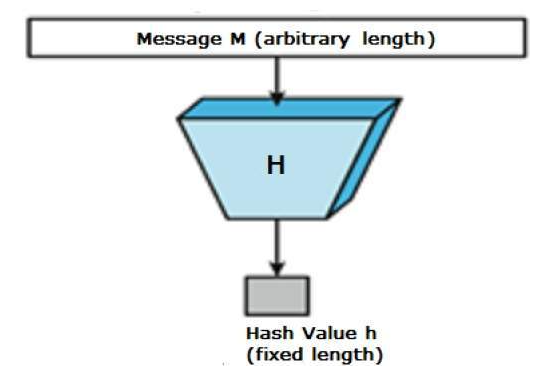

## Introduction

**\_Hashing Algorithms are used to convert an input of any length to an output of a fixed numeric length.\_**

**_What is a message digest? A message digest is a fixed length value that is calculated from a message also known as a hash value._**

**_The message digest is calculated using a hashing algorithm._**

**_Arbitary mean that they can be of any length which is not good for security._**

```
In summary: Hashing algorithms are used to convert an input of any length to an output of a fixed numeric length so that it can't be changed.
```



**Hash functions are used in many applications such as:**

- Digital Authentication
- Password Protection

## Types of Hashing Algorithms

**_There are many types of hashing algorithms. Some of them are:_**

- MD5: Message Digest 5 (128 bits)
- SHA-1: Secure Hash Algorithm 1 (160 bits)
- SHA-2: Secure Hash Algorithm 2 (224, 256, 384 or 512 bits)

```
Note: The higher the number of bits, the more secure the algorithm is.
```

**_For simplicity, we will be using the MD5 algorithm._**

## MD5 Algorithm

**_The MD5 algorithm is a widely used hash function producing a 128-bit hash value._**
**_The MD5 algorithm is used as a cryptographic hash function or a file fingerprint._**

**I will be implementing MD5 in C, I'll take number of steps:**

- [Step 1: Padding](#step-1-padding)
- [Step 2: Append Length](#step-2-append-length)
- [Step 3: Initialize MD Buffer](#step-3-initialize-md-buffer)
- [Step 4: Process Message in 16-Word Blocks](#step-4-process-message-in-16-word-blocks)
- [Step 5: Output](#step-5-output)

## Step 1: Padding

**_Padding is basically adding the original message + padding bits to make the total length of the message a multiple of 512 bits._**
**_The padding bits are always 1 followed by 0s & 512 is the block size of MD5 algorithm._**

```
Are you confused? Let me explain:
```

- **_We have an original message which is 1000 bits long and we want to add padding bits to it._**

**_Let's take multiples of 512 and - 64 from each one:_**

- 512 x 1 = 512 - 64 = 448 which is less than 1000, doesn't work.
- 512 x 2 = 1024 - 64 = 960 which is less than 1000, doesn't work.
- 512 x 3 = 1536 - 64 = 1472 which is more than 1000, works.

**_Now we have 1472 which is the total length of the message with padding bits, so the padding are 1472-1000 = 472 padding bits._**

```
In summary: 1472 is a multiple of 512 (512 x 3) and also 64 less.
```

## Step 2: Append Length

**_We need to append the length of the original message before padding, the steps are:_**

- Calculate (64)mod(original_length) = (64)(mod1000) = 64 bits
- Append 64 bits to the message
- Now the message is 1472 + 64 = 1536 bits long
- The message is again a multiple of 512 (512 x 3)

## Step 3: Initialize MD Buffer

**_A four-word buffer (A,B,C,D) is used to compute the message digest & they are pre-defined._**
**_Here each of A, B, C, D is a 32-bit register. These registers are initialized to the following values in hexadecimal, low-order bytes first:_**

- A = 0x01234567
- B = 0x89abcdef
- C = 0xfedcba98
- D = 0x76543210

## Step 4: Process Message in 16-Word Blocks

**_There are four functions defined in the RSA memo that are used to collapse three 32-bit words into one 32-bit word:_**

- F(X, Y, Z) = (X & Y) | (~X & Z): & is the AND operator
- G(X, Y, Z) = (X & Z) | (Y & ~Z): ~ is the NOT operator
- H(X, Y, Z) = X ^ Y ^ Z: ^ is the XOR operator
- I(X, Y, Z) = Y ^ (X | ~Z): (X | ~Z) is the same as (X ^ Z)

**_The functions F, G, H, and I are similar to the basic logic functions AND, OR, XOR, and NOT, respectively._**

**_We have to do a left rotate operation on each of the 32-bit words for each 16-word block due to the fact that the MD5 algorithm is little-endian._**

**_The message is split into blocks of 512 bits. Each block is split into 16 32-bit words._**

## Step 5: Output

**_The message digest produced as output is A, B, C, D. That is, we begin with the low-order byte of A, and end with the high-order byte of D._**

## Acknowledgements

Check out the [Acknowledgements](https://github.com/Yousinator/Math-For-Computing#acknowledgements) section for more information.
