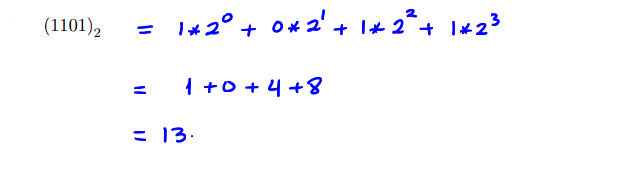
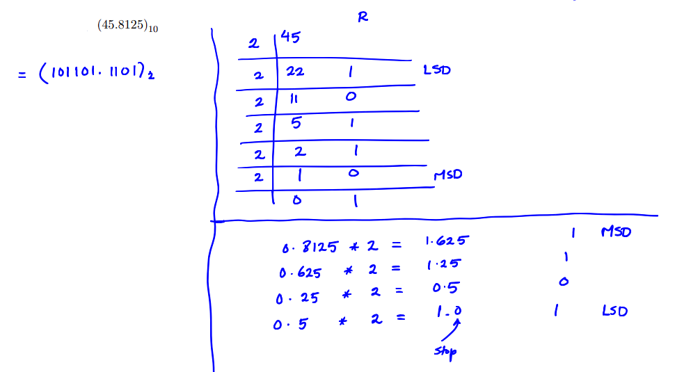

  

<h3 align="center">Number Systems Conversions</h3>

    In a positional number system, there are only a few symbols called digits. A digit is an alphanumeric symbol, used in combinations, to represent numbers in positional number systems. These symbols represent di↵erent values depending upon the position they occupy in a number. (Hence, the prefix positional).   Here, we discuss four common positional number systems: decimal, binary, octal, and hexadecimal.
These systems are classified according to the values of the base of the number system.
     
     
    
  

## Table Of Contents

- [About Number Systems](About-Number-Systems)
- [Binary <--> Decimal](Binary-<-->-Decimal)

  - [Binary to Decimal](Binary-to-Decimal)
  - [Decimal to Binary](Decimal-to-Binary)

- [Binary <--> Octal](Binary-<-->-Octal)
- [Binary <--> Hex](Binary-<-->-Hex)
- [Hex <--> Decimal](Hex-<-->-Decimal)
- [Hex <--> Octal](Hex-<-->-Octal)
- [Octal <--> Decimal](Octal-<-->-Decimal)
- [Number Systems Calculator](Number-Systems-Calculator)

## About Number Systems

Here, we discuss four common positional number systems: decimal, binary, octal, and hexadecimal.

- **_The Binary Number System_** :- The base of the binary system is 2 and it is composed of 2 numerals or symbols. These 2 symbols are 0 and 1; using these symbols as digits of a number, we can express any quantity.

-  **_The Decimal Number System_** :- The base of the decimal system is 10 and it is composed of 10 numerals or symbols. These 10 symbols are 0, 1, 2, 3, 4, 5, 6, 7, 8, 9; using these symbols as digits of a number, we can express any quantity.

- **_The Octal Number System_** :- The base of the octal system is 8 and it is composed of 7 numerals or symbols. These 7 symbols are 0, 1, 2, 3, 4, 5, 6, 7; using these symbols as digits of a number, we can express any quantity.

-  **_The Hexadecimal Number System_** :- The base of the hexadecimal system is 16. The hexadecimal number system has 16 alphanumeric symbols: from 0, 1, 2, 3, 4, 5, 6, 7, 8, 9, A, B, C, D, E, F. Here A is 10, B is 11, C is 12, D is 13, E is 14 and F is 15.

## Binary <--> Decimal

- **_The Binary Number System_** :- The base of the binary system is 2 and it is composed of 2 numerals or symbols; 1 & 2.
-  **_The Decimal Number System_** :- The base of the decimal system is 10 and it is composed of 10 numerals or symbols; 0 - 9.

### Binary to Decimal

| **_(1)_** | Determine the positional value of each binary digit (i.e., the associated weight of the digit).    |
| --------- | -------------------------------------------------------------------------------------------------- |
| **_(2)_** | Multiply each binary digit by its weight (Ex: 1 \* 2^2).                                           |
| **_(3)_** | Sum the products calculated in Step 2. The total is the value of the number in the decimal system. |

 

 

Image by [Dr.Tareq Dalgamoni](../README.md/#acknowledgements)

### Decimal to Binary

#### Converting a Decimal Number to another System (Integers)

| **_(1)_** | Divide the decimal integer to be converted by the new base (2) for binary.                  |
| --------- | ------------------------------------------------------------------------------------------- |
| **_(2)_** | The remainder from Step 1 will be the least significant digit in the new-base number.       |
| **_(3)_** | Divide the quotient from Step 2 by the new base. This will be the next digit (to the left). |
| **_(4)_** | Repeat Steps 1 - 3 until the quotient of the division is zero.                              |

#### Converting a Decimal Number to another System (A Fraction between 0 and 1)

| **_(1)_** | Multiply the decimal fraction to be converted by the new base (2) for binary.                       |
| --------- | --------------------------------------------------------------------------------------------------- |
| **_(2)_** | The integer part from Step 1 is the most significant digit in the new-base number                   |
| **_(3)_** | Multiply the fraction part from Step 2 by the new base. This will be the next digit (to the right). |
| **_(4)_** | Repeat Steps 1 - 3 until the fraction becomes zero.                                                 |

 

 

Image by [Dr.Tareq Dalgamoni](../README.md/#acknowledgements)

## Binary <--> Octal

## Binary <--> Hex

## Hex <--> Decimal

## Hex <--> Octal

## Octal <--> Decimal

## Number Systems Calculator
